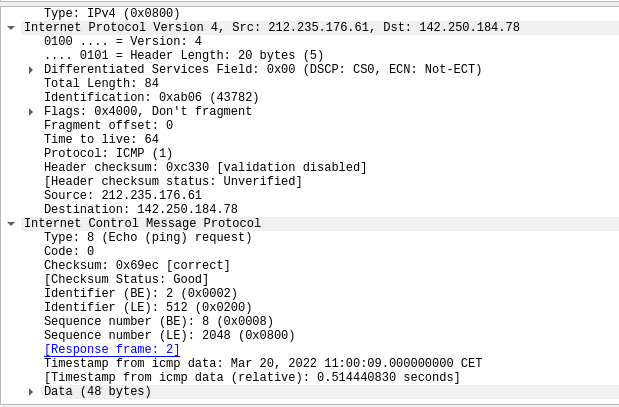
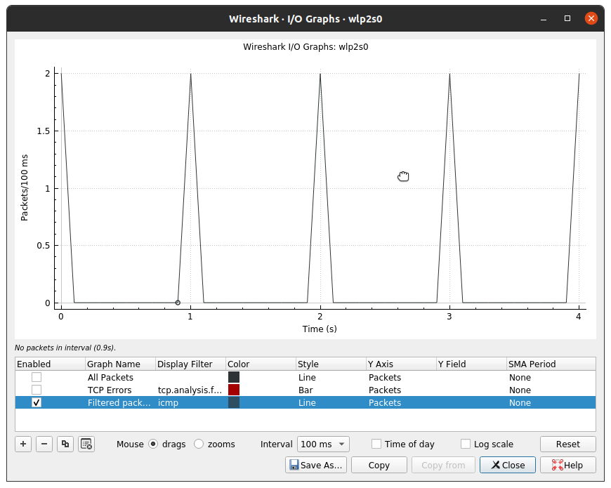
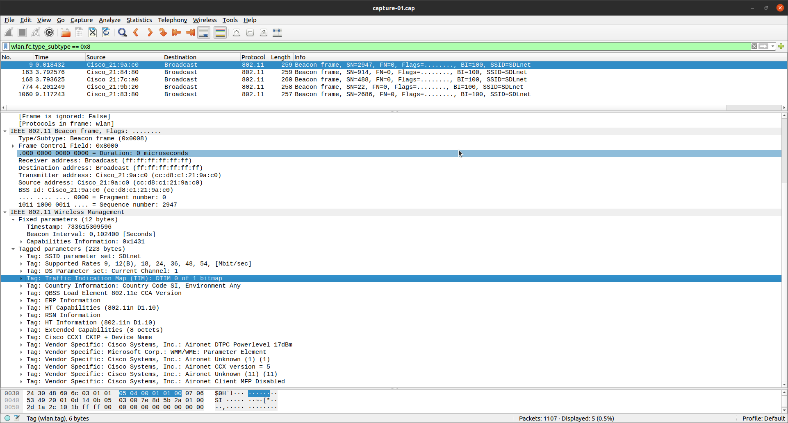

```
 _                ___  _ 
| |____      __  / _ \/ |
| '_ \ \ /\ / / | | | | |
| | | \ V  V /  | |_| | |
|_| |_|\_/\_/    \___/|_|
                         
1. homework for BMO
Author: Lan Vukušič
Date: 20.mar 2022

Capturing ICMP and Beacon packets with wireshark.
```

## ICMP

Iz vsebine IPv4 paketa razberite:

- Time to Live
  - `64`
  - from IPv4
- Protocol
  - `ICMP (1)`
  - from IPv4
- Destination Adress
  - `142.250.184.78`
  - from IPv4
- Type
  - `8 Echo (ping) request`
  - from ICMP
- Code
  - `0`
  - from ICMP
- Timestamp
  - `Mar 20, 2022 11:00:09.000000000 CET`
  - from ICMP




## Beacon Frame pckets

run `sudo wireshark -i {wifiInterface} -I`

Set interface to monitoring mode:
source [this blog](https://kasiviswanathanblog.wordpress.com/2017/02/27/capture-beacon-frames/)

```bash
sudo iw dev <interface name> interface add mon0 type monitor
ip link set <interface name> up
```

- Destination MAC address,
  - `ff:ff:ff:ff:ff:ff`
- Timestamp,
  - `733615309596`
- Beacon Interval,
  - `0,102400 [seconds]`
- SSID,
  - `SDLnet`
- Supported rates,
  - `9, 12(B), 18, 24, 36, 48, 54, [Mbit/sec]`
- Current channel
  - `1`


