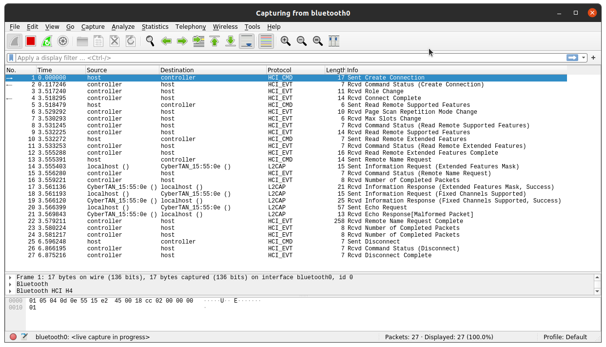

# 5. domača naloga

```
 _              ___  ____  
| |____      __/ _ \| ___| 
| '_ \ \ /\ / / | | |___ \ 
| | | \ V  V /| |_| |___) |
|_| |_|\_/\_/  \___/|____/ 
                           

5. homework for BMO
Author: Lan Vukušič
Date: 20.apr 2022

Bluetooth
```

## Orodja

Uporabil sem naslednja orodja:  

- **hciconfig**
  - konfiguracija bluetooth naprav
- **hcitool**
  - konfiguriranje povezav
  - pošiljanje komand
  - skeniranje
- **l2ping**
  - ping za bluetooth

## Scan omrežja

`sudo hciconfig up`

``` bash
hci0: Type: Primary  Bus: USB
  BD Address: 9C:B6:D0:8C:03:4C  ACL MTU: 1024:8  SCO MTU: 50:8
  UP RUNNING PSCAN ISCAN 
  RX bytes:830 acl:0 sco:0 events:67 errors:0
  TX bytes:4890 acl:0 sco:0 commands:67 errors:0
```

`sudo hcitool -i hci0 scan`

``` bash
Scanning ...
  98:9C:57:37:AE:93 n/a
  00:45:E2:15:55:0E DESKTOP-8PEUCGA
```

`sudo hcitool -i hci0 inq`

``` bash
Inquiring ...
  00:45:E2:15:55:0E  clock offset: 0x44bc  class: 0x2a010c
  98:9C:57:37:AE:93  clock offset: 0x7a4a  class: 0x5a020c
```

## Pinganje

`sudo l2ping -i hci0 -c 5 00:45:E2:15:55:0E`

``` bash
Ping: 00:45:E2:15:55:0E from 9C:B6:D0:8C:03:4C (data size 44) ...
0 bytes from 00:45:E2:15:55:0E id 0 time 3.72ms
0 bytes from 00:45:E2:15:55:0E id 1 time 8.29ms
0 bytes from 00:45:E2:15:55:0E id 2 time 32.33ms
0 bytes from 00:45:E2:15:55:0E id 3 time 24.88ms
0 bytes from 00:45:E2:15:55:0E id 4 time 18.43ms
5 sent, 5 received, 0% loss
```



### analiza paketov

1. Host začne komunikacijo z **create connection**, na kar controller odgovori z **Command status** paketom.  
2. Controller prebere **supported features** in **extended features**.  
3. Host zaprosi za **name request** ter **information request**.  
4. Host zaprosi za **echo Request** na kar controller odgovori z **information response**  
5. Komunikacija se zaključi z **Disconnect** in **Disconnect Complete**  
