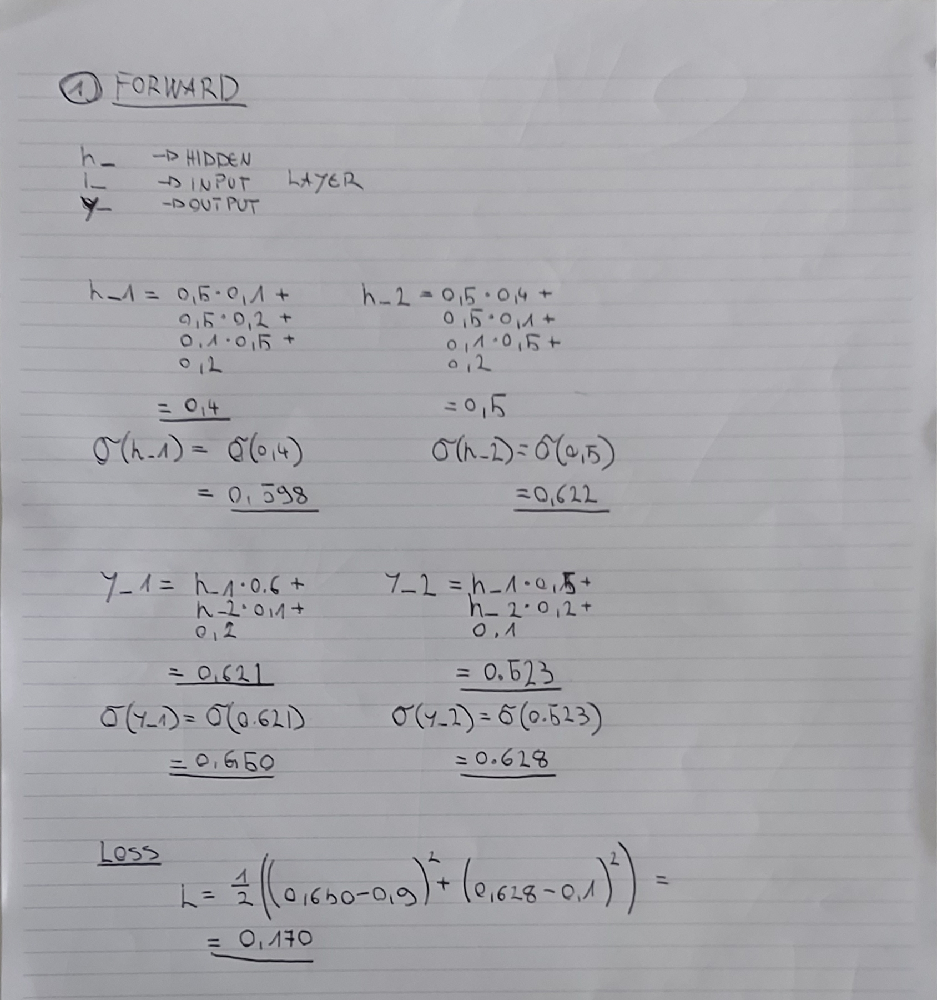
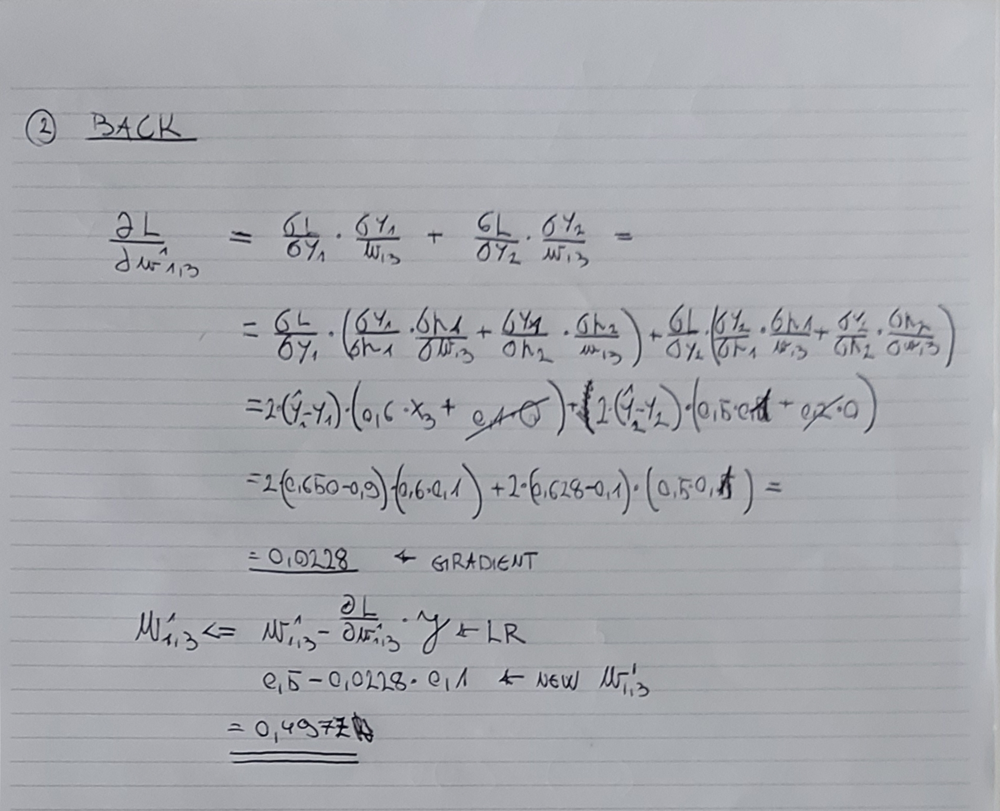

# Homework Assignment 1

## Deep Learning, 23/24

This is the report for the first deep learning exercise.  

### Pen and paper weight update derivation




### Network implementation

I've implemend a feed forward neural network based on the template given, which can be seen [here - `network_template.py`](network_template.py)

Individual components and a final training run can be seen in the [notebook here](hw_01.ipynb)

### L2 Regulaization

Implementing L2 regularization was quite simple. It's implementation can be seen in the previously mentioned [network_template.py](network_template.py). Here are the snippets of code used:

```py
self.weights[i] -= eta * (
                      (m_w_hat / (np.sqrt(v_w_hat) + epsilon))
                      + self.weights[i] * self.l2_alpha
                  )
```

Term `self.weights[i] * self.l2_alpha` subtracts the weighted weight (alpha * weight) from the weights, bringing it closer to zero.  

Implementing the regularization **did not** significantly improve the results of the model.  
I've achieved `0.431 validation loss` without it and `0.438 validation loss` with L2.  

### ADAM Optimizer

The code for the whole optimizer is presented in a snippet here:

```py
beta1 = 0.9
beta2 = 0.999
epsilon = 1e-8
self.t += 1  # Increment time step

for i in range(len(self.weights)):
    self.m_w[i] = beta1 * self.m_w[i] + (1 - beta1) * gw[i]
    self.m_b[i] = beta1 * self.m_b[i] + (1 - beta1) * gb[i]
    self.v_w[i] = beta2 * self.v_w[i] + (1 - beta2) * np.square(gw[i])
    self.v_b[i] = beta2 * self.v_b[i] + (1 - beta2) * np.square(gb[i])

    m_w_hat = self.m_w[i] / (1 - np.power(beta1, self.t))
    m_b_hat = self.m_b[i] / (1 - np.power(beta1, self.t))
    v_w_hat = self.v_w[i] / (1 - np.power(beta2, self.t))
    v_b_hat = self.v_b[i] / (1 - np.power(beta2, self.t))

    # update bias
    self.biases[i] -= eta * m_b_hat / (np.sqrt(v_b_hat) + epsilon)

    # update weights
    if self.l2_alpha > 0:
        self.weights[i] -= eta * (
            (m_w_hat / (np.sqrt(v_w_hat) + epsilon))
            + self.weights[i] * self.l2_alpha
        )
    else:
        # no weight decay
        self.weights[i] -= eta * m_w_hat / (np.sqrt(v_w_hat) + epsilon)
```

Final version of the model uses ADAM optimizer since it converges faster with the same parameters. Due to working on my (underperforming) laptop, fast convergance allowed me to iterate over model parameters faster and thus improving the model.  

SGD and ADAM should converge to simmilar optima[^1], and my results were within margin of error.

### Learning rate decay

I have implemented exponential learning rate decay, following the function given:  
$$\eta_t = \eta e ^ {-kt}$$

The numpy version is presented here:

```py
def lr_decay(step: int, base_lr: float, decay: float):
    return base_lr * np.exp(-step * decay)
```

It decays (decreases) the learning rate after ech iteration (not epoch).  

Final model has a combination of:

- `0.008` lerning rate
- `0.0001` learnign rate decay

### Training

#### Task 1 - achieve 42% accuracy

I've manged to achieve the desired accuracy with a model by giving it an additional layer with 100 neurons:

```py
Network([train_data.shape[0], 100, 100, 50, 10], optimizer="adam", lr_decay=0.0001, weight_decay=0.02)
```

#### ADAM vs SGD

They both performed simmilarly, while ADAM converged faster that SGD.

#### L2 rgularization

As stated in the chapter about L2, the regularization hd little to no effect on the models final performance.

#### Learning rate schedule

When training without a learning rate schedule, I had to start with a smaller learning in order to converge to the same loss (35% accuracy, 1.8 loss).  
Having a learning rate scheduler allowed me to have a higher LR in the beginning of the training which sped up the initial model training.

### Sources

[^1]: [ADAM: A METHOD FOR STOCHASTIC OPTIMIZATION](https://arxiv.org/pdf/1412.6980.pdf)
