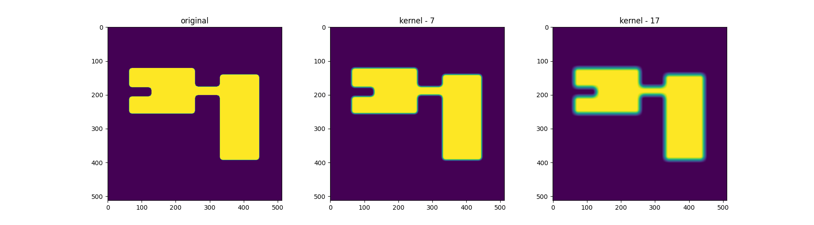
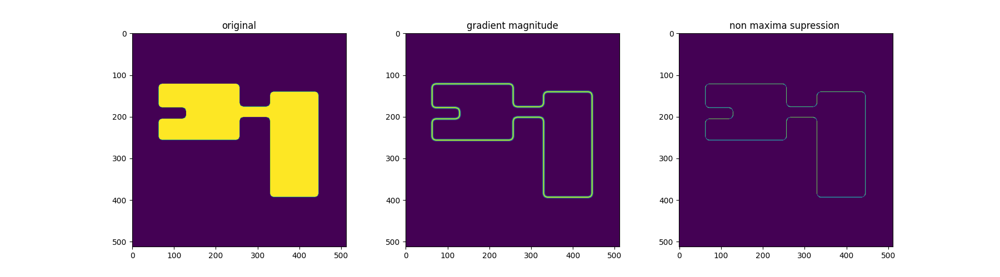
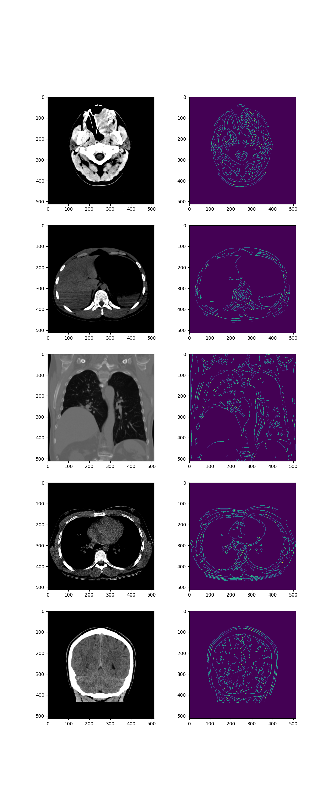

# SECOND REPORT - OBSS

## 2.f (60) Detecting contours of human organs in CT images using the Canny edge detector

## Introdution

In this project, we leverage the well-established Canny edge detector to detect contours of human organs in CT images from the CTMRI DB. The Canny edge detector, known for its precision, is applied step by step, with each substep accompanied by visualizations for clarity. The program takes a CT image as input, determines thresholds empirically, detects edges, and performs edge linking without calculating gradient magnitude and angle arrays. The output is a binarized image, stored in a .png file. Testing involves at least four different CT images from the CTMRI DB, showcasing the effectiveness of the algorithm in contour detection. The subsequent sections provide a detailed walkthrough of the methodology, results, and insights gained.

## Methodology

The methodology employed for contour detection using the Canny edge detector encompasses several key steps, each contributing to the precision and accuracy of the final result.

### Blurring

The initial step involves reducing noise in the CT images through Gaussian blurring. This is crucial for enhancing the performance of the subsequent edge detection steps. Doing so prevents any small changes in image lightness (noise) to be considered as an edge and better resolves real bigger edges.

I've used the gausian kernel, that can be visualized like so:  

### Edge Finding (Canny Operator)

Utilizing the Canny operator, we detect edges in the blurred image. This involves the calculation of gradient magnitudes and orientations to identify areas with significant intensity changes, which potentially represent contours.

This is used by x and y convolution of the sobel kernel:

Since this convoluction is seperable, we can do X and Y passes which gives as these results:  

We can also see the quantized gradient direction on the last image. [0, 1, 2, 3]

### Non-Maxima Suppression

To refine the detected edges, a non-maxima suppression step is implemented. This involves suppressing the gradient values in areas where they are not the maximum along the direction of the gradient. This process helps retain only the most significant edges in the image.

The resulting suppressed image has much thinner edges.

### Hysteresis

The final step, hysteresis, involves edge linking to establish continuous contours. Rather than calculating gradient magnitude and angle arrays, the algorithm directly links edges by considering pixel connectivity. Two empirically determined thresholds, a high and a low threshold, aid in categorizing edges as strong or weak. Strong edges directly contribute to the final output, while weak edges are included if connected to strong edges, enhancing the completeness of detected contours.

## Results

The efficacy of the proposed methodology is vividly demonstrated through application to a diverse set of CT images from the CTMRI DB. The results showcase the successful detection of contours, illustrating the power of the Canny edge detector in medical image processing.  

The visual representation of the process, from the original images through edge detection to the final binarized output, underscores the robustness of the Canny edge detector in identifying contours in medical imagery. This aligns with the algorithm's widespread use in the broader field of computer vision, attesting to its reliability and applicability.  

## Discusion

The Canny edge detector, introduced by John F. Canny in 1986, remains a robust solution for contour detection, evident in our results. With the edge detection challenge long addressed, there's limited space for extensive discussion. The algorithm's enduring utility signifies the stability of established methods, even as ongoing research explores nuances in computer vision. This reinforces the Canny edge detector's significance in medical image processing, acknowledging that the discussion space is constrained due to the well-solved nature of the edge detection problem.  

## Abstract

This project employs the time-tested Canny edge detector to detect contours of human organs in CT images from the CTMRI DB. The methodology, encompassing blurring, edge finding, non-maxima suppression, and hysteresis, is presented with visualizations for clarity. Results showcase the algorithm's effectiveness, emphasizing its historical relevance in computer vision. While the Canny edge detector remains a stalwart in contour detection, the discussion acknowledges limited space for extensive discourse due to the well-solved nature of the edge detection problem. The enduring utility of established methods is evident in this exploration, reinforcing their significance in medical image processing.

## Literature

- **OpenCV:** OpenCV. [https://opencv.org/](https://opencv.org/)

- **Wikipedia - Canny edge detector:** Wikipedia contributors. "Canny edge detector." Wikipedia, The Free Encyclopedia. [https://en.wikipedia.org/wiki/Canny_edge_detector](https://en.wikipedia.org/wiki/Canny_edge_detector)

- **OpenCV Documentation - Canny Edge Detector:** OpenCV Documentation. "Canny Edge Detector." [https://docs.opencv.org/4.x/da/d22/tutorial_py_canny.html](https://docs.opencv.org/4.x/da/d22/tutorial_py_canny.html)

- **NumPy Documentation:** NumPy Documentation. [https://numpy.org/doc/stable/index.html](https://numpy.org/doc/stable/index.html)